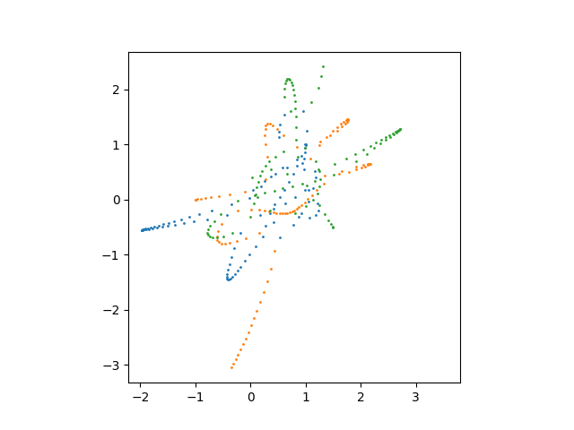
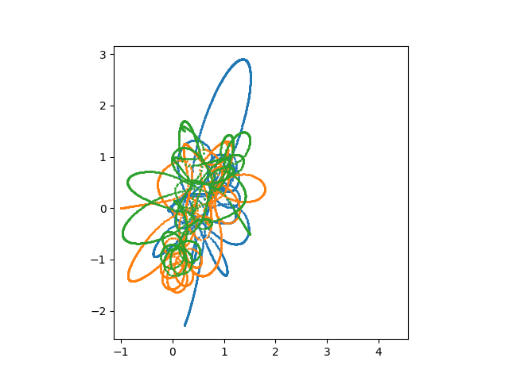
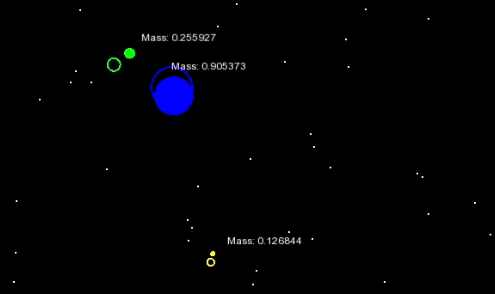

# Newtonian-Gravity
A Machine Learning Simulation of the N-body problem

## Images and Videos
Examples of planets trajectory generated:

**Click** on the image below to see comparison between numerically generated (empty circles) planets and AI predictions (full circles). This videp is based on training data predictions. 

## White paper
Contains theoretical introduction to the problem and numerical way to describe it. It is located in the main directory. ML Data Format is described in there.

## Predicting Future Movement of Planets
This project contains generator in the *data_generation* directory. Generated data is used as input for DML training. Model became overfited because of reasons that are listed in white paper. It predicts movement of bodies in training dataset well.

## Data Format
Data is transported between programs and scripts in this project via JSON format.
### ML Format
This is output format of generator and input format for ML. It was created in a way that it is easy to just parse it after loading it into program.
### GUI Format
Contains same information as ML Format but is easier to process by GUI.
There is converter that will change ML Format into GUI format.

## Model
### Libraries
We use Keras (TensorFlow 2) library with GPU acceleration.

### Configuration
Model is built with input (16 linear neurons) layer, 4 hidden layers (500, 500, 500 and 750 relu neurons) with batch normalisation and dropout and one output layer (480 linear neurons).

## Authors
### Kacper Duda
Theoretical preparations, generator, data processing and model configuration and training. 
### Adam Młyńczak

Graphical representation / comparasion of objects, consulting the build of model, testing the data and file formats.

## Licence
This project is distributed under MIT license. More info in the *LICENSE* file.

